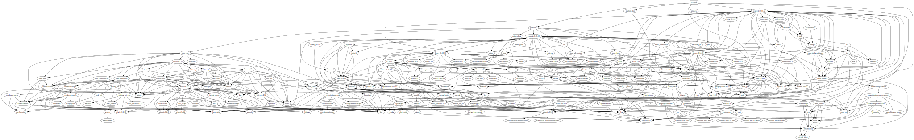

# kev-push

This crate builds a binary that will compare
[CISA's current KEV Catalog](https://www.cisa.gov/known-exploited-vulnerabilities-catalog";)
to a locally cached copy and send a [Pushover](https://pushover.net) notification
if there is a new update. macOS users will also receive a desktop notification.

You can, say, put it in a cron job to check at some regularity and be notified whenever
there is a new addition to the catalog.

At first launch, the program will cache the current KEV JSON. Subsequent launches will
then compare the current catalog served from CISA's site with the cached one
and both update the local cache and fire off a notification.

On macOS and linux, 
[`XDG_CACHE_HOME`](https://specifications.freedesktop.org/basedir-spec/basedir-spec-latest.html)
is used as the base cache directory, so the cache file is at `~/.cache/kev-cache/kev.json`.

On Windows the base cache directory is `%LOCALAPPDATA%`,
so the cache file is at (`C:\\Users\\%USERNAME%\\AppData\\Local\\kev-cache\\kev.json`).

## Why?

This is intended to be more of an example crate than something you'd really want to use since you could replicate the functionality in a very small shell script.

Things it demonstrates:

- Simple binary crate error handling (bubbling up to `main()`) with `anyhow`.
- Using `reqwest` in blocking mode directly.
- Using a third-party REST API crate (`pushover`) with environment variables.
- JSON [de]serialization (via `serde_derive`) from URLs and files.
- Platform/target-specific features, including common platform directories and (macOS notifications.
- Customized `rustfmt` defaults.
- A fairly comprehensive `justfile`, including recipes for:
    - (macOS) creating and code-signing universal binaries
		- SBOM + dependency graph generation
		- generating crate docs to `docs/` for easy GH pages usage

## Dependencies

- [SBOM](bom.xml)

